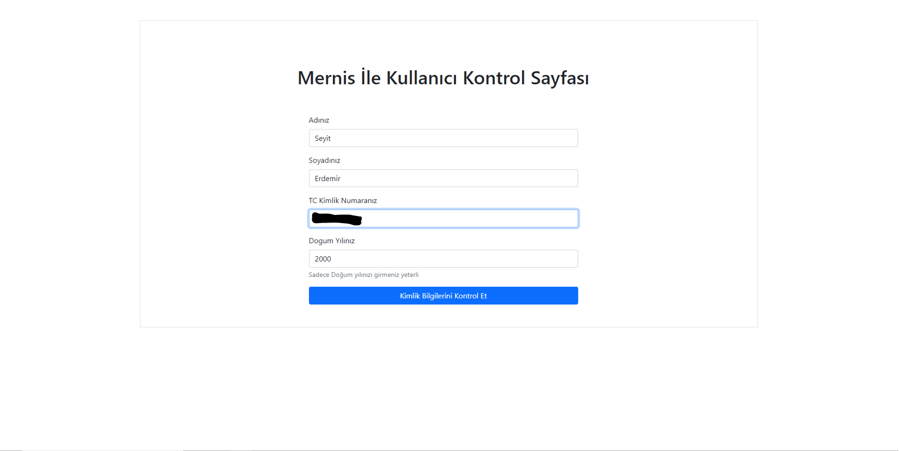
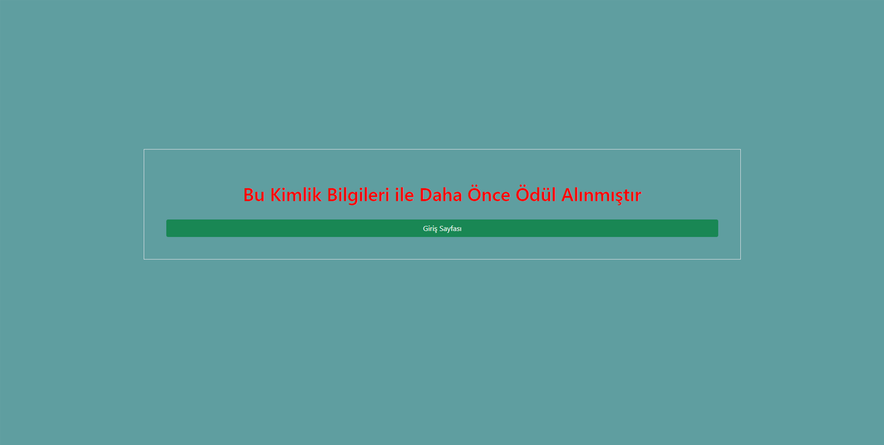

# Login Page with Mernis Control with Php

 

Dosyayı indirdikten sonra Server baglantısı için kullandıgınız aracın içine atınız.(Ben XAMPP kullanıyorum.) Aktif hale gelmesi için içindeki .sql uzantılı sayfayı Veri tabanı sunucusunda içe aktarıyoruz.Ve çalışır hale geliyor.

After downloading the file, drop it into the tool you use for Server connection. (I am using XAMPP.) We import the page with .sql extension in the database server to activate it. And it becomes operational.

### Login Screen
 

### Error Screen
 

### Error Screen
 

### Error Screen
 