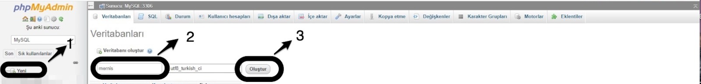
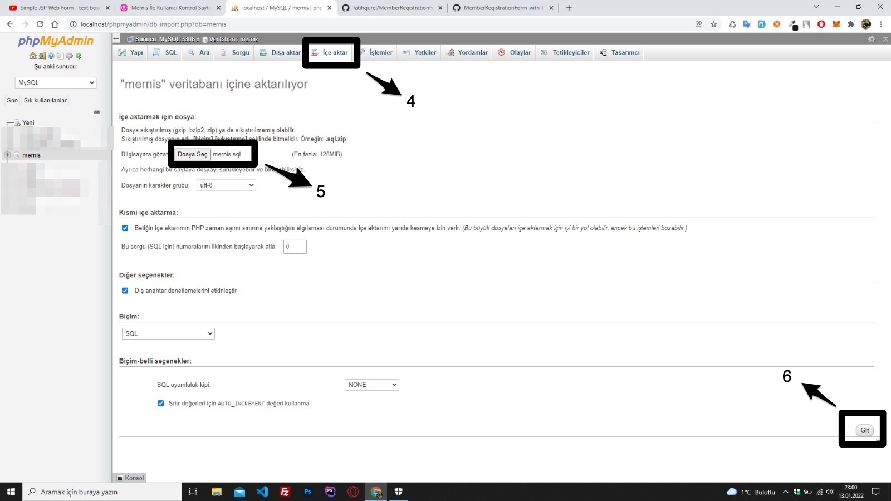
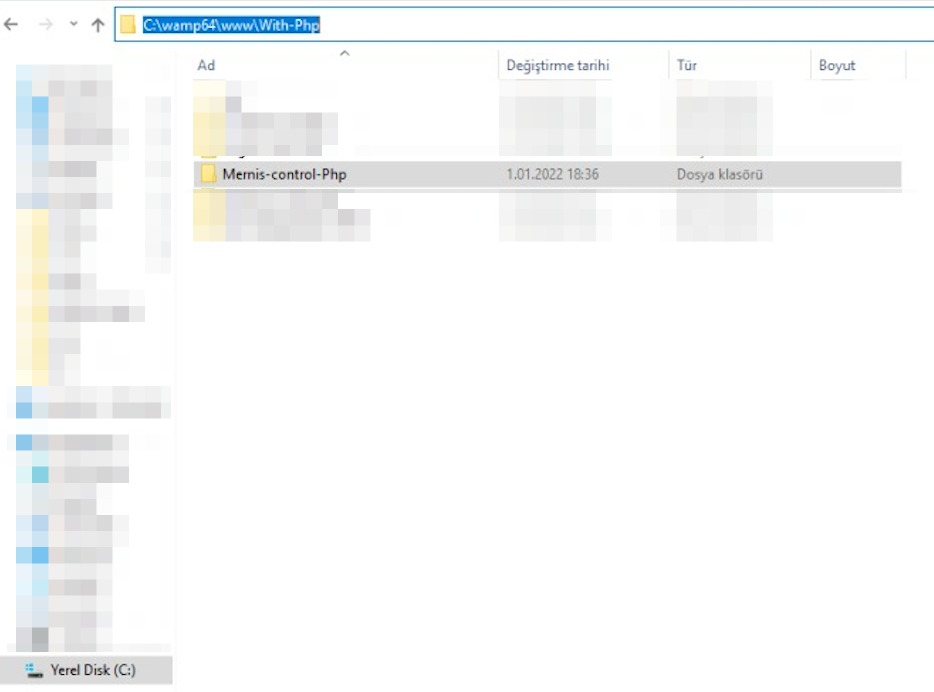

# Login Page with Mernis Control with Php

# Nasıl kullanılır ?
1-Repoyu indirin. 2-WAMP'yi çalıştırın. 3-İndirdiğiniz repoyu "www" dizinine atın. 4-SQL dosyasını yerel veritabanına aktarın.

# How to use ?
1-Download the repo. 2-Run WAMP. 3-Put the downloaded repo to the "www" directory. 4-Transfer the SQL file to the local database.
 

 

 
 
 
 