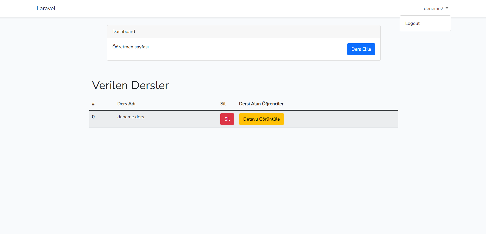
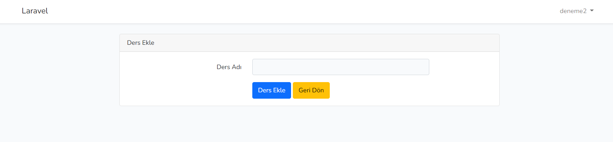
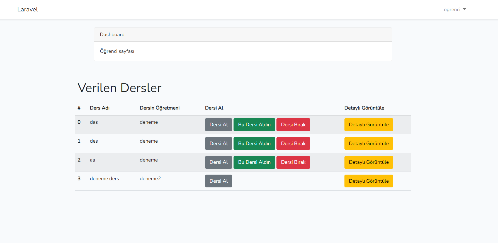
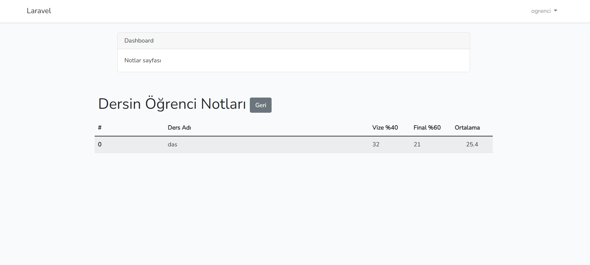

## Not Hesaplama
Kurulum için sırasıyla terminale;

    -> npm install 
    -> composer install
    -> php artisan migrate
    -> php artisan serve

Not: Bilgisayarınızda Php ve MySQL kurulu olması gerekir.MySQL içersinde task isimli bir veritabanı açtıktan sonra terminale yukarıdaki komutları sırasıyla yazınız. 

### Öğretmen Anasayfası

### Öğretmen Ders Ekleme Sayfası

### Öğrenci Anasayfası

### Öğrenci Not Detay Sayfası

 