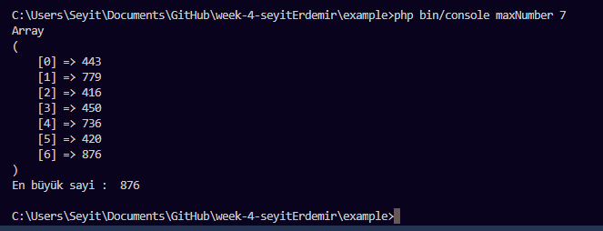
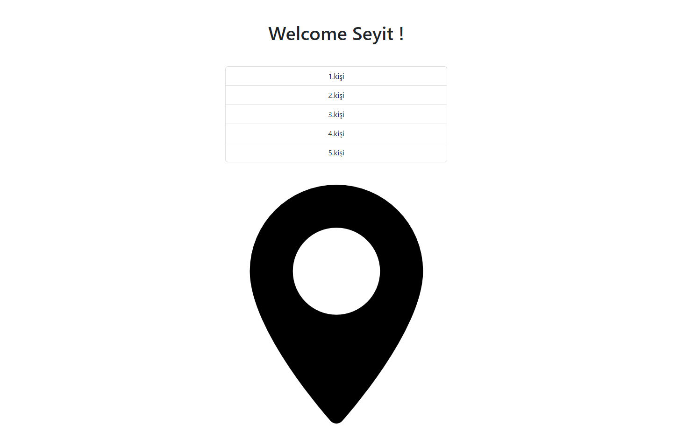

# Week4Assignment

## ARAŞTIRMA (20 puan)
- Test Driven Development ve Behaviour Driven Development arasındaki farkı açıklayınız.

TDD bir geliştirme uygulamasıdır , BDD ise bir ekip metodolojisidir . TDD’de geliştiriciler testleri yazarken, BDD’de otomatik özellikler kullanıcılar veya testçiler tarafından oluşturulur.BDD, bir uygulamanın davranışını son kullanıcının bakış açısından test etmek için tasarlanmıştır, TDD ise daha küçük işlevsellik parçalarını ayrı ayrı test etmeye odaklanır.BDD, istenen işlevselliğe ilişkin somut örnekler bulmak için işbirliği yapan ürün yöneticilerini, geliştiricileri ve test mühendislerini içerir. Herhangi bir uygulamadan önce yüksek düzeyde bir iletişim vardır.

- Unit Test nedir? Unit Test nasıl yapılır?

Unit test uygulamamızın küçük bir parçasını uygulamanın geri kalanından bağımsız bir şekilde çalıştırarak bu parçanın davranışını doğrulayan bir metoddur.

## SYMFONY KONSOL UYGULAMASI OLUŞTURMA (20 puan)
1 ile N arası rastgele pozitif  tamsayıların olduğu bir array içinden en küçük ve en büyük sayıyı bulup, bu sayıları ekrana bastıran bir konsol uygulaması yazınız. Buradaki N değeri konsol uygulamasından parametrik olarak alınacaktır. Dizideki rastgele tamsayılar PHP’nin random fonksiyonuyla oluşturulabilir.

Örnek: 
Konsol Uygulaması için Input: 7
//Random array değerleri: Array = {1,6,743,24,132,54,9}

Çıktı: 
En Büyük Sayı: 743
En Küçük Sayı: 1

## SYMFONY WEB UYGULAMASI OLUŞTURMA (60 puan)
Ders esnasında composer ile oluşturmuş olduğumuz ve twig template içeren Symfony uygulamasını Repo’ya yükleyiniz. Twig template aşağıdaki özellikleri barındırmalıdır:
- En az 2 parametreyi controllerdan almalı (parametrelerden bir tanesi mutlaka array olmalı)
- Ena z 1 asset içermeli (css / js) ve template içinde bu asset kullanılmalı
- Template içinde controllerden alınan çıktı mutlaka döngüde bastırılmalı

