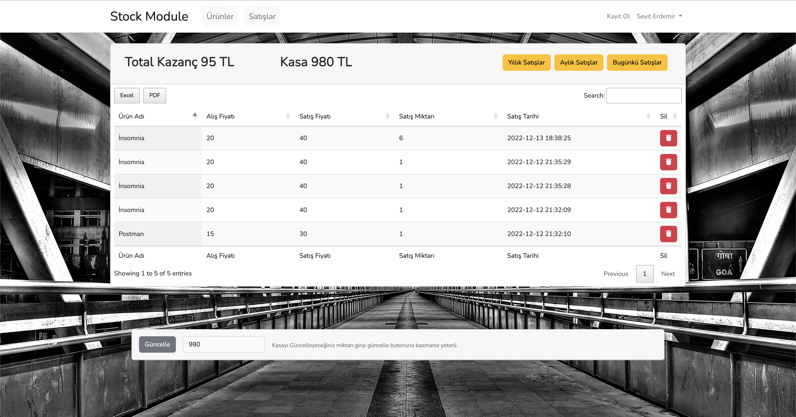

## Stok Modülü

### İçerik

    -> Ürün ekleme güncelleme silme işlemleri
    -> Ürün satıldıktan sonra satışlar bölümüne düşmekte. Buradan günlük , aylık ve yıllık olarak satışlar ve kârlar görülebilmekte , silinebilmekte.
    -> Ürün satıldığında , yeni ürün eklendiğinde , var olan ürün güncellendiğinde girilen fiyat bilgilerine göre toplam kasa artmakta azalmakta.
    -> Kasa satışlar sayfasında güncellenebilmekte.

Kurulum için sırasıyla terminale;

    -> npm install 
    -> composer install
    -> php artisan migrate
    -> php artisan serve

Not: Bilgisayarınızda Php ve MySQL kurulu olması gerekir.MySQL içersinde task isimli bir veritabanı açtıktan sonra terminale yukarıdaki komutları sırasıyla yazınız. Örnek veritanı için OrnekVeriTabani klasörüne bakabilirisiniz.

### Ürünler Sayfası

### Satışlar Sayfası

 